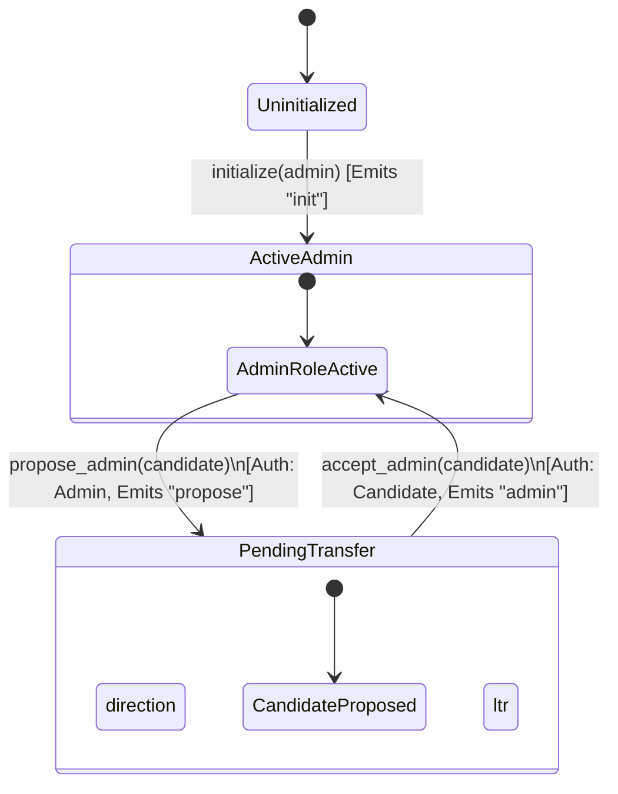

# Admin & Operator Roles and Lifecycle

This document describes the privileged roles, their permissions, the lifecycle of administrative controls, and security properties in the AnchorNet contract.

---

## Privileged Roles

AnchorNet defines two privileged roles: **Administrator (Admin)** and **Operator**.

### 1. Administrator (Admin)
The Admin is the owner of the contract. This role has full administrative control, including the ability to:
- Transfer administrative privilege to a new address (either via a single-step or safe two-step flow).
- Appoint, update, or remove the Operator.
- Pause and unpause the contract (liquidity/settlement mutations).
- Configure system-wide parameters (fees, minimum liquidity floor, max settlement amount, settlement expiry).
- Register/deregister anchors and waive/unwaive fees for anchors.
- Execute settlements and collect accrued fees.

### 2. Operator
The Operator is a secondary, restricted role designed specifically for operational management (monitoring and emergency response).
- **Scope Limitation**: The Operator is strictly limited to calling `pause`, `unpause`, and `extend_instance_ttl`.
- **Security Property**: The Operator **cannot** modify fees, change the administrator, appoint other operators, or execute/cancel settlements. This isolation follows the principle of least privilege: a compromised operator key can pause/unpause the system to prevent exploits, but cannot drain fees or hijack contract ownership.

---

## Auth Verification Helpers

Within [`src/lib.rs`](file:///c:/Users/HP/drips/work/AnchorNet-Contracts/src/lib.rs), two internal helper functions enforce these roles:

- **`require_admin(env)`**:
  - Checks if the contract is initialized.
  - Retrieves the administrator's address from storage and calls `admin.require_auth()`.
- **`require_admin_or_operator(env, caller)`**:
  - Checks if the contract is initialized.
  - Verifies that the provided `caller` address matches either the administrator or the currently appointed operator.
  - Calls `caller.require_auth()`.

---

## Entrypoints & Authorization Matrix

Below is a complete matrix of every entrypoint in the contract that is restricted to either the Admin or Operator, including their auth requirements and the events they emit from [`src/events.rs`](file:///c:/Users/HP/drips/work/AnchorNet-Contracts/src/events.rs).

| Function Name | Required Authorization | Emitted Event (Topic / Data) | Cross-References | Description |
| :--- | :--- | :--- | :--- | :--- |
| `initialize` | None (Callable once) | `("init",)` / `admin` | [`events::initialized`](file:///c:/Users/HP/drips/work/AnchorNet-Contracts/src/events.rs#L25) | Sets the initial administrator of the contract. |
| `set_admin` | Admin | `("admin",)` / `new_admin` | [`events::admin_changed`](file:///c:/Users/HP/drips/work/AnchorNet-Contracts/src/events.rs#L31) | Transfers administrative control directly to `new_admin` in a single step. |
| `propose_admin` | Admin | `("propose",)` / `candidate` | [`events::admin_proposed`](file:///c:/Users/HP/drips/work/AnchorNet-Contracts/src/events.rs#L37) | Proposes `candidate` as the next administrator (step 1 of two-step transfer). |
| `accept_admin` | Candidate | `("admin",)` / `candidate` | [`events::admin_changed`](file:///c:/Users/HP/drips/work/AnchorNet-Contracts/src/events.rs#L31) | Accepts the pending administrator role (step 2 of two-step transfer). |
| `set_operator` | Admin | `("operator",)` / `operator` | [`events::operator_changed`](file:///c:/Users/HP/drips/work/AnchorNet-Contracts/src/events.rs#L134) | Appoints or replaces the contract Operator. |
| `pause` | Admin or Operator | `("paused",)` / `true` | [`events::paused_changed`](file:///c:/Users/HP/drips/work/AnchorNet-Contracts/src/events.rs#L71) | Pauses contract mutations (deposits, withdrawals, opening settlements, etc.). |
| `unpause` | Admin or Operator | `("paused",)` / `false` | [`events::paused_changed`](file:///c:/Users/HP/drips/work/AnchorNet-Contracts/src/events.rs#L71) | Resumes normal contract operations. |
| `extend_instance_ttl` | Admin or Operator | None | None | Extends the contract instance and WASM code TTL. |
| `register_anchor` | Admin | `("anchor", anchor)` / `()` | [`events::anchor_registered`](file:///c:/Users/HP/drips/work/AnchorNet-Contracts/src/events.rs#L42) | Registers an anchor as authorized. |
| `register_anchors` | Admin | Multiple `("anchor", anchor)` / `()` | [`events::anchor_registered`](file:///c:/Users/HP/drips/work/AnchorNet-Contracts/src/events.rs#L42) | Registers a batch of anchors. |
| `deregister_anchor` | Admin | `("deanchor", anchor)` / `()` | [`events::anchor_removed`](file:///c:/Users/HP/drips/work/AnchorNet-Contracts/src/events.rs#L80) | Removes an anchor from the registry. |
| `set_min_liquidity` | Admin | `("minliq", asset)` / `floor` | [`events::min_liquidity_changed`](file:///c:/Users/HP/drips/work/AnchorNet-Contracts/src/events.rs#L128) | Sets the minimum liquidity floor for a pool. |
| `set_max_settlement_amount`| Admin | `("maxamt", asset)` / `amount` | [`events::max_settlement_amount_changed`](file:///c:/Users/HP/drips/work/AnchorNet-Contracts/src/events.rs#L141) | Caps the settlement reserve amount for an asset. |
| `set_fee` | Admin | `("fee",)` / `bps` | [`events::fee_changed`](file:///c:/Users/HP/drips/work/AnchorNet-Contracts/src/events.rs#L75) | Configures the global protocol fee (bps). |
| `set_asset_fee` | Admin | `("assetfee", asset)` / `bps` | [`events::asset_fee_changed`](file:///c:/Users/HP/drips/work/AnchorNet-Contracts/src/events.rs#L147) | Sets a fee override for a specific asset. |
| `clear_asset_fee` | Admin | `("feeclear", asset)` / `()` | [`events::asset_fee_cleared`](file:///c:/Users/HP/drips/work/AnchorNet-Contracts/src/events.rs#L154) | Removes an asset fee override. |
| `collect_fees` | Admin | `("collect", asset)` / `amount` | [`events::fees_collected`](file:///c:/Users/HP/drips/work/AnchorNet-Contracts/src/events.rs#L109) | Withdraws collected protocol fees. |
| `set_fee_waiver` | Admin | `("waiver", anchor)` / `waived`| [`events::fee_waiver_changed`](file:///c:/Users/HP/drips/work/AnchorNet-Contracts/src/events.rs#L102) | Grants/revokes anchor fee waivers. |
| `set_settlement_expiry_ledgers`| Admin | `("expiry",)` / `ledgers` | [`events::settlement_expiry_changed`](file:///c:/Users/HP/drips/work/AnchorNet-Contracts/src/events.rs#L115) | Configures settlement expiry window. |
| `execute_settlement` | Admin | `("executed", id)` / `()` | [`events::settlement_executed`](file:///c:/Users/HP/drips/work/AnchorNet-Contracts/src/events.rs#L92) | Finalizes a settlement. |

---

## Admin Transfer Lifecycle

Administrator transfers can happen in two ways:
1. **Single-Step Transfer (`set_admin`)**: Instantly updates the admin role.
   - **Risk**: If the `new_admin` address is mistyped or represents an address for which keys are lost or inaccessible, control of the contract is permanently lost.
2. **Two-Step Transfer (`propose_admin` -> `accept_admin`)**: Guarantees that the new administrator is active and holds the private key matching the proposed address.
   - **Step 1 (`propose_admin`)**: The current Admin designates a `candidate` address. This creates a pending state but doesn't change active permissions.
   - **Step 2 (`accept_admin`)**: The `candidate` address must call `accept_admin` and provide cryptographic authorization. Upon successful signature checks, they become the new Admin and the pending state is cleared.

### Lifecycle Diagrams

#### Two-Step Transfer Flow (Recommended)



#### Single-Step Transfer Flow vs. Two-Step

```mermaid
graph TD
    A[AdminRoleActive] -->|set_admin| B(New Admin Active)
    style B fill:#f9f,stroke:#333,stroke-width:2px
    
    A -->|propose_admin| C[Candidate Proposed]
    C -->|accept_admin| B
    
    subgraph Single-Step Path (Skipped steps)
        B
    end
```

---

## Operator Least-Privilege Security Model

The Operator role is designed to decouple emergency operations (such as pausing in the event of an off-chain incident or vulnerability discovery) from critical financial parameters and ownership controls.

By separating these roles, the system gains the following security properties:
- **Blast Radius Reduction**: A compromised operator key can only pause or unpause the contract (or extend TTL). It **cannot** modify fees, steal protocol funds, change parameters, or modify who owns/controls the contract.
- **Strictly Scoped Privileges**:
  - `admin` -> retains ownership, parameters, and full recovery controls.
  - `operator` -> restricted to operation/liveness management.
